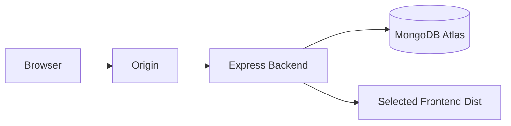

# Architecture Overview

DocMan is a MERN-style application with two frontend surfaces:

- `frontend`: legacy React/Vite interface
- `frontend-vue`: Vue/Vuetify migration interface

The backend is an Express API using MongoDB through Mongoose.

Production deployments use the backend to serve the selected static frontend bundle.

