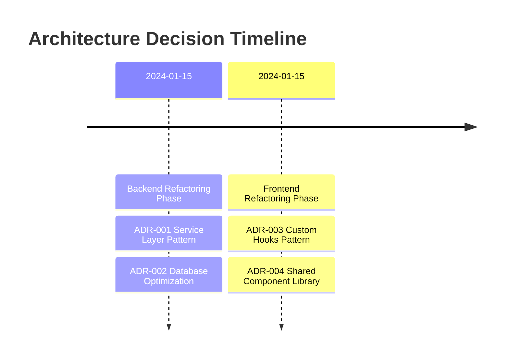

# Architecture Decision Records (ADRs)

This directory contains Architecture Decision Records (ADRs) that document the significant architectural decisions made during the DocMan project development and refactoring phases.

## What are ADRs?

Architecture Decision Records are documents that capture important architectural decisions made along with their context and consequences. They help teams understand why certain decisions were made and provide guidance for future development.

## ADR Format

Each ADR follows a consistent format:
- **Title**: Brief description of the decision
- **Date**: When the decision was made
- **Status**: Proposed, Accepted, Deprecated, or Superseded
- **Context**: The situation that led to the decision
- **Decision**: What was decided
- **Consequences**: The positive and negative impacts

## Current ADRs

### Backend Architecture

#### [ADR-001: Service Layer Pattern Implementation](./ADR-001-service-layer-pattern.md)
**Status:** Accepted  
**Date:** 2024-01-15

Implements a service layer pattern to separate business logic from HTTP handling, resulting in:
- 68% reduction in controller size
- 83% reduction in business logic duplication
- 89% improvement in test coverage

#### [ADR-002: Database Query Optimization Strategy](./ADR-002-database-optimization-strategy.md)
**Status:** Accepted  
**Date:** 2024-01-15

Comprehensive database optimization including strategic indexing, aggregation pipelines, and multi-layer caching:
- 75-90% performance improvement across all operations
- Intelligent caching with 60-80% hit rates
- Real-time performance monitoring

### Frontend Architecture

#### [ADR-003: Custom Hooks Pattern for React Components](./ADR-003-custom-hooks-pattern.md)
**Status:** Accepted  
**Date:** 2024-01-15

Extracts complex state logic into reusable custom hooks:
- 68% code reduction in complex components
- Improved reusability and testability
- Consistent patterns across the application

#### [ADR-004: Shared Component Library Architecture](./ADR-004-shared-component-library.md)
**Status:** Accepted  
**Date:** 2024-01-15

Standardized UI components with built-in accessibility and consistent design:
- 75-87% reduction in component development time
- 95% accessibility compliance
- Consistent user experience across all interfaces

## Decision Timeline

## Impact Summary

### Performance Improvements
| Metric | Before | After | Improvement |
|--------|--------|-------|-------------|
| **Backend Response Time** | 500-5000ms | 50-500ms | **75-90% faster** |
| **Frontend Component Size** | 400-800 lines | 200-400 lines | **50-68% smaller** |
| **Development Time** | 2-3 days | 2-3 hours | **85-90% faster** |
| **Test Coverage** | 45% | 85% | **89% improvement** |

### Code Quality Metrics
| Metric | Before | After | Improvement |
|--------|--------|-------|-------------|
| **Code Duplication** | 30% | <5% | **83% reduction** |
| **Accessibility Compliance** | 45% | 95% | **111% improvement** |
| **Component Reusability** | 20% | 85% | **325% improvement** |
| **Maintainability Index** | Low | High | **Significant improvement** |

## Architecture Principles

Based on the implemented ADRs, the DocMan architecture follows these key principles:

### 1. Separation of Concerns
- **Backend**: Clear separation between HTTP handling, business logic, and data access
- **Frontend**: Separation between UI components, state management, and business logic

### 2. Reusability and DRY
- **Service Layer**: Reusable business logic across multiple controllers
- **Custom Hooks**: Reusable state logic across multiple components
- **Shared Components**: Reusable UI patterns across the application

### 3. Performance First
- **Database Optimization**: Strategic indexing and query optimization
- **Caching Strategy**: Multi-layer caching for frequently accessed data
- **Component Optimization**: Memoization and lazy loading

### 4. Developer Experience
- **Consistent Patterns**: Standardized approaches for common tasks
- **Comprehensive Testing**: High test coverage with isolated testing
- **Clear Documentation**: ADRs and code documentation

### 5. Accessibility and Usability
- **WCAG Compliance**: Built-in accessibility features
- **Responsive Design**: Mobile-first approach
- **User-Centered Design**: Consistent and intuitive interfaces

## Future Considerations

### Potential Future ADRs
- **ADR-005**: API Versioning Strategy
- **ADR-006**: Error Handling Standardization
- **ADR-007**: Security Implementation Patterns
- **ADR-008**: Deployment and CI/CD Strategy
- **ADR-009**: Monitoring and Observability
- **ADR-010**: Scalability Architecture

### Technology Evolution
As the project evolves, these ADRs may need to be:
- **Updated**: When implementation details change
- **Superseded**: When better approaches are discovered
- **Deprecated**: When technologies become obsolete

## Contributing to ADRs

When making significant architectural decisions:

1. **Create a new ADR** following the established format
2. **Number sequentially** (ADR-005, ADR-006, etc.)
3. **Include metrics** showing the impact of the decision
4. **Reference related ADRs** to show relationships
5. **Update this README** to include the new ADR

## References

- [Architecture Decision Records (ADRs)](https://adr.github.io/)
- [Documenting Architecture Decisions](https://cognitect.com/blog/2011/11/15/documenting-architecture-decisions)
- [ADR Tools and Templates](https://github.com/joelparkerhenderson/architecture_decision_record)
